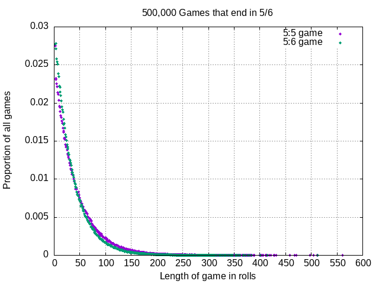

# Daily Coding Problem: Problem #769 [Hard]

This problem was asked by Two Sigma.

Alice wants to join her school's Probability Student Club.
Membership dues are computed via one of two simple probabilistic games.

The first game: roll a die repeatedly.
Stop rolling once you get a five followed by a six.
Your number of rolls is the amount you pay, in dollars.

The second game: same,
except that the stopping condition is a five followed by a five.

Which of the two games should Alice elect to play?
Does it even matter?
Write a program to simulate the two games and calculate their expected value.

## Build and Run

I wrote a single program that generalizes the games.
The program simulates rolls of a D6 die,
letting the user set number of simulated games,
and which values of a roll and subsequent roll constitute the end of a game.

```sh
$ go build game.go
$ ./game 100000 5 6
Playing 100000 games, until 5 followed by 6
Mean fee 36.00
Check pip count distribution
roll a 1        600712 times
roll a 2        598860 times
roll a 3        600280 times
roll a 4        600017 times
roll a 5        599290 times
roll a 6        600686 times
3599845 total rolls
$ ./game 100000 5 5
Playing 100000 games, until 5 followed by 5
Mean fee 42.25
Check pip count distribution
roll a 1        705916 times
roll a 2        704133 times
roll a 3        703648 times
roll a 4        705058 times
roll a 5        702122 times
roll a 6        704063 times
4224940 total rolls
```

## Analysis

The problem statement is a little loose.

* What size die? In this day of sophisticated D&D players, one never knows.
I'm assuming a 6-sided die.
* Does alice have to pay a minimum of $2?
That is, are the last 2 rolls included in the number of rolls?
I assumed they are, so Alice pays a minimum of $2,
but the way the problem is worded it could be 0, $1 or $2.
* How often are dues collected? Yearly? Monthly?

[My code](game.go)

The game simulator consistently gives a 5:6 game as the cheapest,
averaging $36 as the Probability Club dues.
A 5:5 game would cost Alice about $42 in dues.
Corresponding median fees are $25.00 and $29.00.

I do not know why this is,
but it looks like Alice should choose the 5:6 game to probably get the
lowest Probability Club dues,
but look further down at the probability distribution.

## Interview Analysis

I'm not sure this merits a "Hard" rating.
The only thing that's weird is keeping track of whether the last roll was a 5 or not.
I'd give it a "Medium" maybe.

This seems like a problem statement that invites the candidate to ask questions.
It's possible that the interviewer wanted to elicit the candidate's thought processes,
which would be revealed in questions to the interviewer,
rather than seeing actual coding.

I think the candidate should ask questions.
Just assuming probably gets you nowhere with interviewers that ask this question.

I personally find the probability calculations for this game very challenging.
It's easy to simulate than it is to determine the choice of game analytically.

## Probability Distribution



This is the results from two 500,000 game simulation,
one for the 5:6 game and another for the 5:5 game.
Image generated with [gnuplot](http://gnuplot.info/) and a [script](mkdist).
The longest games are above 500 rolls.
Poor Alice, that's high dues for a school club.

Also note that for up to about 50 rolls,
Alice would pay less if she played the 5:5 game,
rather than the 5:6 game,
which is contrary to the mean and median indicators calculated above.
Given that the median number of rolls is 25 or 29,
maybe Alice should choose the 5:5 game over the 5:6 game.

I wrote a [program](combo2.go)
to iterate through all possible combinations of N rolls of a D6.
I did this in an effort to understand the probability distributions.

I ran the program iterating through all rolls up to 10, 60466176 (6<sup>10</sup>)combinations

#### 5:6 game

|Roll count  | game count | game proportion |
|------------|-----------:|--------:|
|2|1679616|0.027778|
|3|1679616|0.027778|
|4|1632960|0.027006|
|5|1586304|0.026235|
|6|1540944|0.025484|
|7|1496880|0.024756|
|8|1454076|0.024048|
|9|1412496|0.023360|
|10|1372105|0.022692|

#### 5:5 game

|Roll count  | game count | game proportion |
|------------|-----------:|--------:|
|2|1679616|0.027778|
|3|1399680|0.023148|
|4|1399680|0.023148|
|5|1360800|0.022505|
|6|1328400|0.021969|
|7|1296000|0.021433|
|8|1264500|0.020913|
|9|1233750|0.020404|
|10|1203750|0.019908|

These are extremely close to the probablistic game simulations.

The 2-roll probablity is 1/36 = 0.027778 for both 5:5 and 5:6 games.
This makes sense, as 2 rolls are indendent of each other:
a 5 followed by another 5 is exactly the same as a 5 followed by a 6.

The 3-roll probability for the 5:6 game makes sense:
rolling any number on the first roll doesn't effect the next two rolls,
and you have to roll a 5, then a 6 to terminate the game.

The 3-roll probability for the 5:5 game is a little less obvious.
You can roll a 5 on the first roll, and a 5 on the second
roll, so 1/6 of the possible 3-rolls win at 2-rolls.
